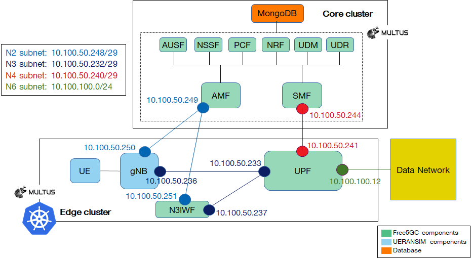

# Free5GC + eUPF with Calico BGP



## Requirements

- Kubernetes cluster with Calico and Multus CNI
- [helm](https://helm.sh/docs/intro/install/) installed
- calico backend configured as BIRD

change `calico_backend` parameter to `bird` in configmap with name `calico-config` and then restart all pods with name `calico-node-*`

- compile and install gtp5g kernel module on every worker node:

```
apt-get update; apt-get install git build-essential -y; \
cd /tmp; \
git clone --depth 1 --branch v0.7.3 https://github.com/free5gc/gtp5g.git; \
cd gtp5g/; \
make && make install
```

check that the module is loaded:

`lsmod | grep ^gtp5g`

- configure helm repos

```
helm repo add towards5gs https://raw.githubusercontent.com/Orange-OpenSource/towards5gs-helm/main/repo/
helm repo update
```

## Deployment steps

1. install free5gc

`make free5gc`

2. create subscriber in free5gc via WebUI

 redirect port from webui pod to localhost

 ```powershell
 kubectl port-forward service/webui-service 5000:5000 -n free5gc
 ```

 open http://127.0.0.1:5000 in your browser (for auth use user "admin" with password "free5gc"), go to menu "subscribers", click "new subscriber", leave all values as is, press "submit"

 close port forward with `Ctrl + C`

3. configure calico BGP settings

`make calico`

4. install eupf

`make upf`

5. install UERANSim

`make ue1`

## Check steps

1. exec shell in UE pod

`kubectl -n free5gc exec -ti deployment/ueransim-ue -- /bin/bash`

2. run ICMP test

`ping -I uesimtun0 1.1.1.1`

## Undeploy steps

1. undeploy all

`make clean`
