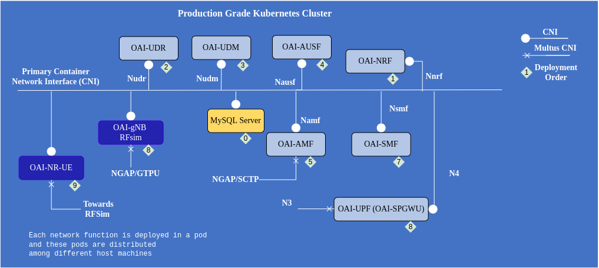

# OpenAir Core + OpenAir RAN

<b>⚠️ not finished, work in progress</b>

## Requirements

- [helm](https://helm.sh/docs/intro/install/) installed

    change `calico_backend` parameter to `bird` in configmap with name `calico-config` and then restart all pods with name `calico-node-*` -->

## Deployment steps

1. install eupf

<b>⚠️ not finished, work in progress</b>

    `make upf`

2. configure calico BGP settings. Here, we configure Calico BGP peer, create Calico IP Pool (for NAT) and configure Felix for save external routes (recevied by BGP from eUPF BIRD)

<b>⚠️ not finished, work in progress</b>

    `make calico`

3. install openair core

`git clone -b master https://gitlab.eurecom.fr/oai/cn5g/oai-cn5g-fed`

change directory to `oai-cn5g-fed/charts/oai-5g-core/oai-5g-basic`

apply charts how describe here https://gitlab.eurecom.fr/oai/cn5g/oai-cn5g-fed/-/blob/master/docs/DEPLOY_SA5G_HC.md#4-deploying-helm-charts but use namespace `open5gs`

4. install GNB

    `make gnb`

5. install UE

    `make ue`

## Check steps

1. exec shell in UE pod

    `kubectl -n open5gs exec -ti deployment/ue-oai-nr-ue -- /bin/bash`

2. run ICMP test

    `ping -I oaitun_ue1 1.1.1.1`

## Undeploy steps

1. undeploy all

    `make clean`
