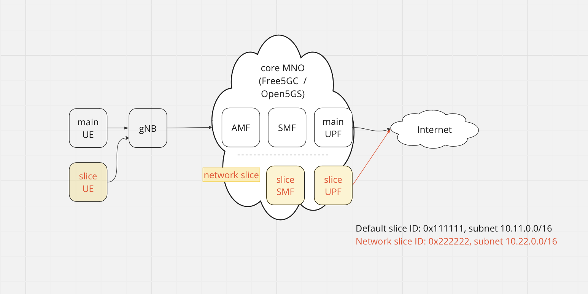

# Open5GS + eUPF with Calico BGP + Slices. UE2 with two interfaces connected to different slices



## Requirements

- Kubernetes cluster with Calico
- [helm](https://helm.sh/docs/intro/install/) installed
- calico backend configured as BIRD

    change `calico_backend` parameter to `bird` in configmap with name `calico-config` and then restart all pods with name `calico-node-*`

- configure helm repos

    ```
    helm repo add openverso https://gradiant.github.io/openverso-charts/
    helm repo update
    ```

## Deployment steps

1. install eupf for slice 1

    `make upf`

2. install eupf for slice 2

    `make upf2`

3. configure calico BGP settings. Here, we configure Calico BGP peer, create Calico IP Pool (for NAT) and configure Felix for save external routes (recevied by BGP from eUPF BIRD)

    `make calico`

4. install open5gs

    `make open5gs`

5. configure SMF for slice 1

    `make smf`

6. configure SMF for slice 2

    `make smf2`

7. install gNB

    `make gnb`

8. install UERANSim for slice 1

    `make ue1`

9. install UERANSim for PDU sessions in slice 2 + slice 1 

    `make ue2`

## Check steps

1. exec shell in UE1 pod

    `kubectl -n open5gslices2 exec -ti deployment/ueransim1-ueransim-ues-ues -- /bin/bash`

2. run ICMP test

    `ping -I uesimtun0 1.1.1.1`

3. exec shell in UE2 pod

    ```
	kubectl -n open5gslices2 exec -ti deployment/ueransim2-ueransim-ues-ues -- /bin/bash
	ip a
	```
	See there is two interfaces `uesimtun` with ip addresses from different subnets, like this:
	```
	7: uesimtun0: <POINTOPOINT,PROMISC,NOTRAILERS,UP,LOWER_UP> mtu 1400 qdisc fq_codel state UNKNOWN group default qlen 500
		link/none
		inet 10.11.0.17/32 scope global uesimtun0
		   valid_lft forever preferred_lft forever
		inet6 fe80::bb72:195c:a705:d4ef/64 scope link stable-privacy
		   valid_lft forever preferred_lft forever
	8: uesimtun1: <POINTOPOINT,PROMISC,NOTRAILERS,UP,LOWER_UP> mtu 1400 qdisc fq_codel state UNKNOWN group default qlen 500
		link/none
		inet 10.22.0.4/32 scope global uesimtun1
		   valid_lft forever preferred_lft forever
		inet6 fe80::8a1d:8a51:ff53:f9c2/64 scope link stable-privacy
		   valid_lft forever preferred_lft forever
	```

4. run ICMP test

    `ping -I uesimtun0 1.1.1.1`

## Undeploy steps

1. undeploy all

    `make clean`
