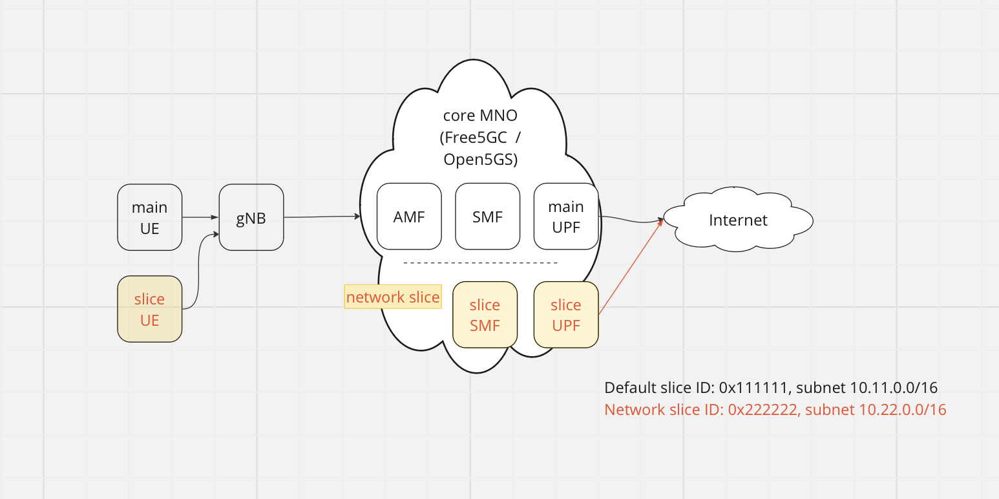

# Open5GS + eUPF with Calico BGP + Slices



## Requirements

- Kubernetes cluster with Calico and Multus CNI
- [helm](https://helm.sh/docs/intro/install/) installed
- calico backend configured as BIRD

change `calico_backend` parameter to `bird` in configmap with name `calico-config` and then restart all pods with name `calico-node-*`

- configure helm repos

```
helm repo add openverso https://gradiant.github.io/openverso-charts/
helm repo update
```

## Deployment steps

* install eupf for slice 1

`make upf`

* install eupf for slice 2

`make upf2`

* configure calico BGP settings

`make calico`

* install open5gs

`make open5gs`

* configure SMF for slice 1

`make smf`

* configure SMF for slice 2

`make smf2`

* install gNB

`make gnb`

* install UERANSim for slice 1

`make ue1`

* install UERANSim for slice 2

`make ue2`

## Check steps

* exec shell in UE1 pod

`kubectl -n open5gs exec -ti deployment/ueransim1-ueransim-ues-ues -- /bin/bash`

* run ICMP test

`ping -I uesimtun0 1.1.1.1`

* exec shell in UE2 pod

`kubectl -n open5gs exec -ti deployment/ueransim2-ueransim-ues-ues -- /bin/bash`

* run ICMP test

`ping -I uesimtun0 1.1.1.1`

## Undeploy steps

* undeploy all

`make clean`
