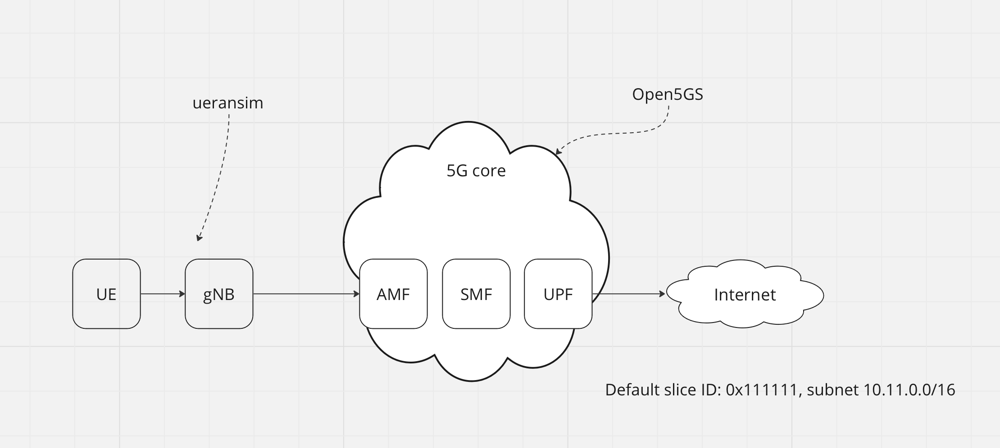

# Open5GS + eUPF with Calico BGP



## Requirements

- Kubernetes cluster with Calico
- [helm](https://helm.sh/docs/intro/install/) installed
- calico backend configured as BIRD

    change `calico_backend` parameter to `bird` in configmap with name `calico-config` and then restart all pods with name `calico-node-*`

- configure helm repos

    ```
    helm repo add openverso https://gradiant.github.io/openverso-charts/
    helm repo update
    ```

## Deployment steps

1. install eupf

    `make upf`

2. configure calico BGP settings. Here, we configure Calico BGP peer, create Calico IP Pool (for NAT) and configure Felix for save external routes (recevied by BGP from eUPF BIRD)

    `make calico`

3. install open5gs

    `make open5gs`

4. configure SMF

    `make smf`

5. install gNB

    `make gnb`

6. install UERANSim

    `make ue1`

## Check steps

1. exec shell in UE pod

    `kubectl -n open5gs exec -ti deployment/ueransim1-ueransim-ues-ues -- /bin/bash`

2. run ICMP test

    `ping -I uesimtun0 1.1.1.1`

## Undeploy steps

1. undeploy all

    `make clean`
