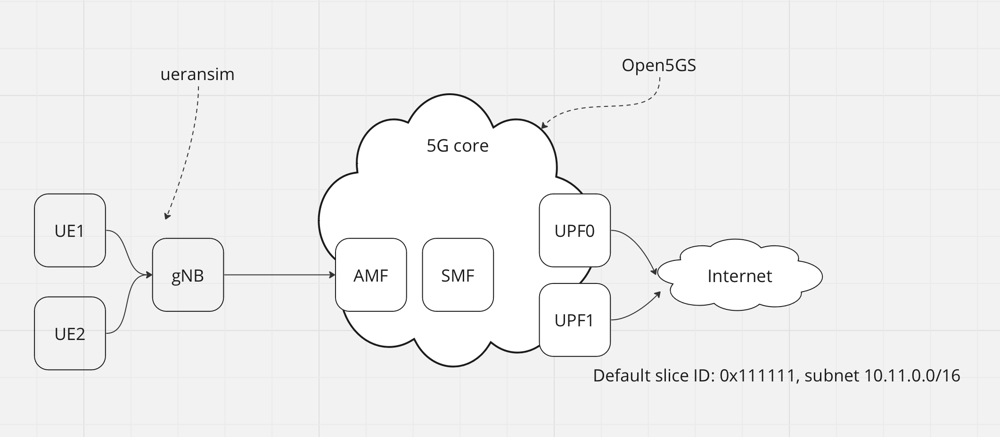

# Open5GS + multiple load balanced eUPF



## Requirements

- [helm](https://helm.sh/docs/intro/install/) installed
- configure helm repos

    ```
    helm repo add openverso https://gradiant.github.io/openverso-charts/
    helm repo update
    ```

# Attention!

---

this document work in progress!!

now, we dont have solution for routing and NAT with one IP pool and multiple eUPF

**check steps not working**

---

## Deployment steps

1. install eupf (for example we use 2 replicas of eUPF)

    `make upf`

check pods and ips:

```bash
$ kubectl get po -n open5gs -l "app.kubernetes.io/name=eupf" -o wide
NAME     READY   STATUS    RESTARTS   AGE     IP             NODE      NOMINATED NODE   READINESS GATES
eupf-0   1/1     Running   0          6m29s   10.233.64.17   edgecom   <none>           <none>
eupf-1   1/1     Running   0          6m19s   10.233.64.44   edgecom   <none>           <none>
```

2. install open5gs

    `make open5gs`

3. configure SMF

    `make smf`

4. install gNB

    `make gnb`

5. install UERANSim

    `make ue1`

    `make ue2`


6. check SMF logs:


ue1 is connected and work via eUPF 0 (10.233.64.17)

```
10/16 19:05:30.573: [smf] INFO: [Added] Number of SMF-UEs is now 1 (../src/smf/context.c:898)
10/16 19:05:30.573: [smf] INFO: [Added] Number of SMF-Sessions is now 1 (../src/smf/context.c:2975)
10/16 19:05:30.596: [smf] INFO: UE SUPI[imsi-999700000000001] DNN[internet] IPv4[10.11.0.2] IPv6[] (../src/smf/npcf-handler.c:495)
10/16 19:05:30.599: [gtp] INFO: gtp_connect() [10.233.64.17]:2152 (../lib/gtp/path.c:60)
```

ue2 is connected and work via eUPF 1 (10.233.64.44)

```
10/16 19:05:42.749: [smf] INFO: [Added] Number of SMF-UEs is now 2 (../src/smf/context.c:898)
10/16 19:05:42.749: [smf] INFO: [Added] Number of SMF-Sessions is now 2 (../src/smf/context.c:2975)
10/16 19:05:42.767: [smf] INFO: UE SUPI[imsi-999700000000002] DNN[internet] IPv4[10.11.0.3] IPv6[] (../src/smf/npcf-handler.c:495)
10/16 19:05:42.774: [gtp] INFO: gtp_connect() [10.233.64.44]:2152 (../lib/gtp/path.c:60)
```

## Check steps

1. exec shell in UE pod

    `kubectl -n open5gs exec -ti deployment/ueransim1-ueransim-ues-ues -- /bin/bash`

2. run ICMP test

    `ping -I uesimtun0 1.1.1.1`

## Undeploy steps

1. undeploy all

    `make clean`
