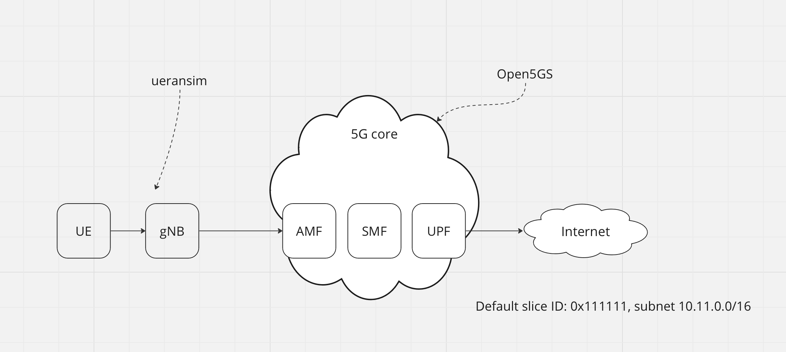

# Open5GS + eUPF with Calico BGP + srsUE


This deployment helps to create an end-to-end fully open-source 5G network, consisting from srsUE, the srsRAN Project gNodeB with Open5GS 5G core network.

## Requirements

- Kubernetes cluster with Calico
- [helm](https://helm.sh/docs/intro/install/) installed
- calico backend configured as BIRD

    change `calico_backend` parameter to `bird` in configmap with name `calico-config` and then restart all pods with name `calico-node-*`

- configure helm repos

    ```
    helm repo add openverso https://gradiant.github.io/openverso-charts/
    helm repo update
	git clone https://github.com/edgecomllc/srsRAN5Gue-zmg-gNB.git ../srsRAN5Gue-zmg-gNB
    ```

## Deployment steps

0. `cd docs/deployments/srsran-gnb/`

1. install eupf

    `make upf`

2. configure calico BGP settings. Here, we configure Calico BGP peer, create Calico IP Pool (for NAT) and configure Felix for save external routes (recevied by BGP from eUPF BIRD)

    `make calico`

3. install open5gs

    `make open5gs`

4. configure SMF

    `make smf`

5. install gNB with srsUE

    `make srs`


## Check steps

1. exec shell in UE pod

    `kubectl -n srs-open5gs exec -ti statefulset/srsran-srs-5g -- /bin/bash`

2. run ICMP test

    `ping -I tun_srsue 1.1.1.1`

## Undeploy steps

1. undeploy all

    `make clean`
