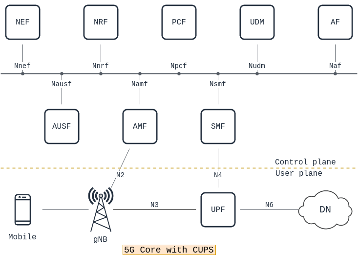
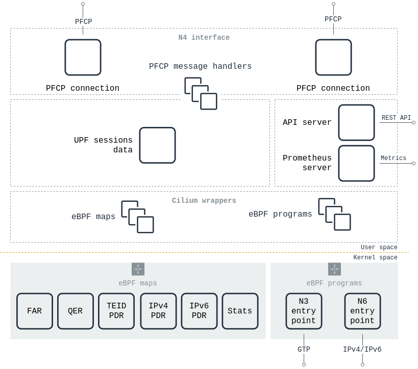

# eUPF

<div align="center">

[![GitHub Release][release-img]][release]
[![Build][build-img]][build]
[![Test][test-img]][test]
[![Security][security-test-img]][security-test]
[![License: Apache-2.0][license-img]][license]

</div>

eUPF — это проект функции userplane (UPF) с открытым исходным кодом для использования внутри или «вне» любого ядра 3GPP 5G. Цель проекта — предоставить "онаблюдаемое" и легко развертываемое программное обеспечение для различных случаев, таких как multi-access edge computing (MEC) и разделение локального трафика (network slicing). eUPF построен на основе eBPF для обеспечения высокой "наблюдаемости" и производительности.

eUPF был протестирован с тремя различными ядрами 5G: Free5GC, Open5GS и OpenAirInterface. Во время тестирования также использовался OpenAirInterface gNB.

## Что такое ядро 5G сети и CPUS

Ядро 5G использует виртуализированные функции сети (NVF) для обеспечения связи и услуг.
Разделение плоскостей управления и пользователя (CUPS) — это важное усовершенствование архитектуры, которое разделяет плоскости управления и плоскости пользователя внутри ядра 5G.
Функция userplane (UPF) — это функция «декапсуляции и маршрутизации», которая извлекает трафик плоскости пользователя из протокола туннелирования GPRS (GTP) и направляет его в общедоступную сеть передачи данных или локальную сеть по наилучшему доступному пути.



Перечень возможных направлений прикладного использования описан [в статье про прикладное использование eUPF](possible_usage.md)

## Quick start guide

Быстрый и простой способ — загрузить и запустить наш докер-образ. Будет запущен автономный eUPF с конфигурацией по умолчанию.:
```bash
sudo docker run -d --rm --privileged \
  -v /sys/fs/bpf:/sys/fs/bpf \ 
  -v /sys/kernel/debug:/sys/kernel/debug:ro \
  -p 8080 -p 9090 --name your-eupf-def \
   ghcr.io/edgecomllc/eupf:main
```
### Замечания
- 📝 *Linux Kernel **5.15.0-25-generic** — это минимальная версия ядра, на которой eUPF был протестирован. Предыдущие версии не поддерживаются.*
- ℹ Файловая система eBPF(bpffs) должна быть предварительно смонтирована на хостовой системе. eUPF использует bpffs для хранение настроек обработки трафик между перезапусками. Т.о. трафик будет обрабатываться по созданным правилам даже во время перезапуска или обновления eUPF.
Для того, чтобы смонтировать bpffs выполните команду: `sudo mount bpffs /sys/fs/bpf -t bpf`
- ℹ Для выполнения низкоуровневых операций, таких как загрузка объектов ebpf, требуются некоторые дополнительные привилегии.(NET_ADMIN & SYS_ADMIN)
- ℹ При запуске eUPF устанавливает значения rlimits memlock, поэтому требуется дополнительное разрешение(ulimit) для выполнение данной операции в контейнере

<details><summary><i>Параметры запуска, которые вы, возможно, захотите изменить.</i></summary>
<p>

   - UPF_INTERFACE_NAME=lo    *Network interfaces handling N3 (GTP) & N6 (SGi) traffic.*
   - UPF_N3_ADDRESS=127.0.0.1 *IPv4 address for N3 interface*
   - UPF_XDP_ATTACH_MODE=generic *XDP attach mode. Generic-only at the moment*
   - UPF_API_ADDRESS=:8080    *Local host:port for serving [REST API](api.md) server*
   - UPF_PFCP_ADDRESS=:8805   *Local host:port that PFCP server will listen to*
   - UPF_PFCP_NODE_ID=127.0.0.1  *Local NodeID for PFCP protocol. Format is IPv4 address*
   - UPF_METRICS_ADDRESS=:9090   *Local host:port for serving Prometheus mertrics endpoint*

</p>
</details>
</p>

В реальных сценарих вам, скорее всего, придется заменить имена интерфейсов и IP-адреса теми, которые используются в вашей среде. Вы можете сделать это, например, с помощью опции `-e`:

```bash
sudo docker run -d --rm -v --privileged \
  -v /sys/fs/bpf:/sys/fs/bpf \ 
  -v /sys/kernel/debug:/sys/kernel/debug:ro \
  -p 8081 -p 9091 --name your-eupf-custom \
  -e UPF_INTERFACE_NAME=[eth0,n6] -e UPF_XDP_ATTACH_MODE=generic \
  -e UPF_API_ADDRESS=:8081 -e UPF_PFCP_ADDRESS=:8806 \
  -e UPF_METRICS_ADDRESS=:9091 -e UPF_PFCP_NODE_ID=10.100.50.241 \
  -e UPF_N3_ADDRESS=10.100.50.233 \
  ghcr.io/edgecomllc/eupf:main
```

## Что дальше??
Просмотрите описание **[eUPF configuration guide](Configuration.md)**, в котором указаны основные параметры конфигурации eUPF.

В **[eUPF installation guide](install.md)** можно узнать, как запускать eUPF в разных средах с различными реализациями ядра 5G с использованием docker-compose или кластера Kubernetes..

Работа с метриками и статистикой описана **[eUPF metrics and monitoring guide](metrics.md)**.

Ссылки на различные сценарии применения указаны в **[Implementation expamples](../../docs/implementation_examples.md)**.

## Различные варианты установки

eUPF как часть базовой сети мобильной связи 5G реализует функцию шлюза сети передачи данных. Он связывается с SMF через протокол PFCP (интерфейс N4) и пересылает пакеты между ядром и сетями передачи данных (интерфейсы N3 и N6 соответственно). Эти две основные части UPF реализованы в виде двух отдельных компонентов: controlplane и dataplane.

Controlplane eUPF — это приложение пользовательского пространства, которое получает правила обработки пакетов от SMF и настраивает плоскость пересылки для правильной пересылки.

Dataplane eUPF основана на обработке пакетов eBPF. При запуске eUPF добавляет программу перехвата eBPF XDP для обработки сетевых пакетов как можно ближе к сетевому адаптеру. Программа eBPF состоит из нескольких этапов конвейера: определение PDR, применение правил шлюзования, качества обслуживания и пересылки.

eUPF полагается на маршрутизацию ядра при принятии решения о маршрутизации входящих сетевых пакетов. Если невозможно определить маршрут пакета с помощью поиска FIB ядра, eUPF передает такой пакет ядру в качестве резервного пути. Этот подход, очевидно, влияет на производительность, но позволяет поддерживать правильный процесс маршрутизации ядра (например, заполнение таблиц arp).

### Краткое описание функций

#### Поддержка FAR 

eUPF поддерживает правила FAR в PDR. Поддерживается только одно правило FAR для каждого PDR.

#### Поддержка QER

eUPF поддерживает правила QER в PDR. В настоящее время поддерживается только одно правило QER для каждого PDR.

#### Поддержка фильтров SDF

eUPF может применять фильтры SDF в PDR. В настоящее время поддерживается только один фильтр SDF для каждого туннеля GTP.

#### Управление GTP 

eUPF поддерживает отправку запросов GTP Echo к соседним узлам GTP. Каждый соседний узел GTP должен быть явно настроен с использованием параметра конфигурации `gtp_peer`.

### Архитектура eUPF

<details><summary>Show me</summary>

#### Общий обзор архитектуры


#### Детальная схема


</details>

### План развития проекта

<details><summary>Show me</summary>

#### Control plane

- [x]  PFCP Association Setup/Release and Heartbeats
- [x]  Session Establishment/Modification with support for PFCP entities such as Packet Detection Rules (PDRs), Forwarding Action Rules (FARs), QoS Enforcement Rules (QERs).
- [ ]  UPF-initiated PFCP association
- [x]  UPF-based UE IP address assignment

#### Data plane

- [x]  IPv4 support
- [x]  N3, N4, N6 interfaces
- [x]  Single & Multi-port support
- [x]  Static IP routing
- [x]  Basic QoS support with per-session rate limiting
- [x]  I-UPF/A-UPF ULCL/Branching (N9 interface)

#### Management plane
- [x]  Free5gc compatibility
- [x]  Open5gs compatibility
- [x]  Integration with Prometheus for exporting PFCP and data plane-level metrics
- [ ]  Monitoring/Debugging capabilities using tcpdump and cli

#### 3GPP specs compatibility
- [x]  `FTUP` F-TEID allocation / release in the UP function is supported by the UP function.
- [x]  `UEIP` Allocating UE IP addresses or prefixes.
- [ ]  `SSET` PFCP sessions successively controlled by different SMFs of a same SMF Set.
- [ ]  `MPAS` Multiple PFCP associations to the SMFs in an SMF set.
- [ ]  `QFQM` Per QoS flow per UE QoS monitoring.
- [ ]  `GPQM` Per GTP-U Path QoS monitoring.
- [ ]  `RTTWP` RTT measurements towards the UE Without PMF.

 </details>

## Компиляция из исходного кода

### Требования и зависимости

−	Ubuntu 22.04 LTS или выше

−	Git 2.34
−	Golang 1.20.3
−	Clang 14.0.0
−	LLVM 14.0
−	Gcc 11.4.0
−	libbpf-dev 0.5.0
−	Swag 1.8.12
−	Linux Kernel 5.15.0-25

**На Ubuntu 22.04**, вы можете установить их с помощью следующей команды:

#### Основные зависимости
```bash
sudo apt install wget git golang clang llvm gcc-multilib libbpf-dev
```

#### Установка Golang 1.20.3
ℹ Этот шаг можно пропустить, если утилита go версии 1.20.3 уже установлена в системе.

```bash
sudo rm -rf /usr/local/go
wget https://go.dev/dl/go1.20.3.linux-amd64.tar.gz
sudo tar -C /usr/local -xzf go1.20.3.linux-amd64.tar.gz
export PATH="/usr/local/go/bin:${PATH}"
```

### Сборка

#### Шаг 1. Установите инструмент командной строки Swag для Golang.
Используется для автоматического создания документации RESTful API.

```bash
go install github.com/swaggo/swag/cmd/swag@v1.8.12
```

#### Шаг 2. Клонируйте репозиторий eUPF и перейдите в каталог.

```bash
git clone https://github.com/edgecomllc/eupf.git
cd eupf
```

#### Шаг 3: Запустите генераторы кода

```bash
go generate -v ./cmd/...
```

При выполнении команды может возникнуть ошибка:
```
running "swag": exec: "swag": executable file not found in $PATH
``` 

В этом случае нужно убедиться, что утилита `swag` была успешно установлена на шаге 1. Кроме того, нужно убедиться, что путь к исполняемому файлу `swag`` прописан в переменной окружения PATH. 

Обычно путь к исполняемым файлам Go уже прописан в PATH. Если это не так, то его можно прописать командой `export PATH=$(go env GOPATH)/bin:$PATH` и повторить текущй шаг.

#### Шаг 4: Осуществите сборку проекта eUPF

```bash
go build -v -o bin/eupf ./cmd/
```
#### Шаг 5: Запустите приложение

Запустить бинарный файл с привилегиями, позволяющими увеличить [memory-ulimits](https://prototype-kernel.readthedocs.io/en/latest/bpf/troubleshooting.html#memory-ulimits)

```bash
sudo ./bin/eupf
```

Это должно запустить приложение с конфигурацией по умолчанию. Настройте содержимое файла конфигурации и аргументы командной строки в соответствии с вашим приложением и средой.

### Создайте докер-образ

Используйте эту команду для создания образа докера eupf: `docker build -t local/eupf:latest .`

Вы также можете определить несколько аргументов сборки для настройки образа eUPF.: `docker build -t local/eupf:latest --build-arg BPF_ENABLE_LOG=1 --build-arg BPF_ENABLE_ROUTE_CACHE=1 .`

### Аппаратные требования

- CPU: Поддерживается большиенство архитектур CPU, включая: x86, x86_64, x86, ppc64le, armhf, armv7, aarch64, ppc64le, s390x
- CPU ядра: 1 ядра достаточно для запуска eUPF
- RAM: вам потребуется до 70MB для запуска самого eUPF и до 512MB для запуска ядра Linux
- HDD: 50MB свободного пространства требуется для установки eUPF. Поддерживаются различные типы носителей: HDD, SSD, SD-card, USB-stick
- NIC: Любой внешний или внутренний сетевой интерфейс, который поддерживается Linux

## Contribution

Пожалуйста, создайте issue в данном проекте для того, чтобы поделиться идеями или сообщить о недоработках.

## License
Этот проект поддерживает лицензию [Apache-2.0 Creative Commons License](https://www.apache.org/licenses/LICENSE-2.0), детали указаны в файле [LICENSE file](../../LICENSE)

---

[release]: https://github.com/edgecomllc/eupf/releases
[release-img]: https://img.shields.io/github/release/edgecomllc/eupf.svg?logo=github
[build]: https://github.com/edgecomllc/eupf/actions/workflows/build.yml
[build-img]: https://github.com/edgecomllc/eupf/actions/workflows/build.yml/badge.svg
[test]: https://github.com/edgecomllc/eupf/actions/workflows/test.yml
[test-img]: https://github.com/edgecomllc/eupf/actions/workflows/test.yml/badge.svg
[security-test]: https://github.com/edgecomllc/eupf/actions/workflows/trivy.yml
[security-test-img]: https://github.com/edgecomllc/eupf/actions/workflows/trivy.yml/badge.svg
[license]: https://github.com/edgecomllc/eupf/blob/main/LICENSE
[license-img]: https://img.shields.io/badge/License-Apache%202.0-blue.svg
